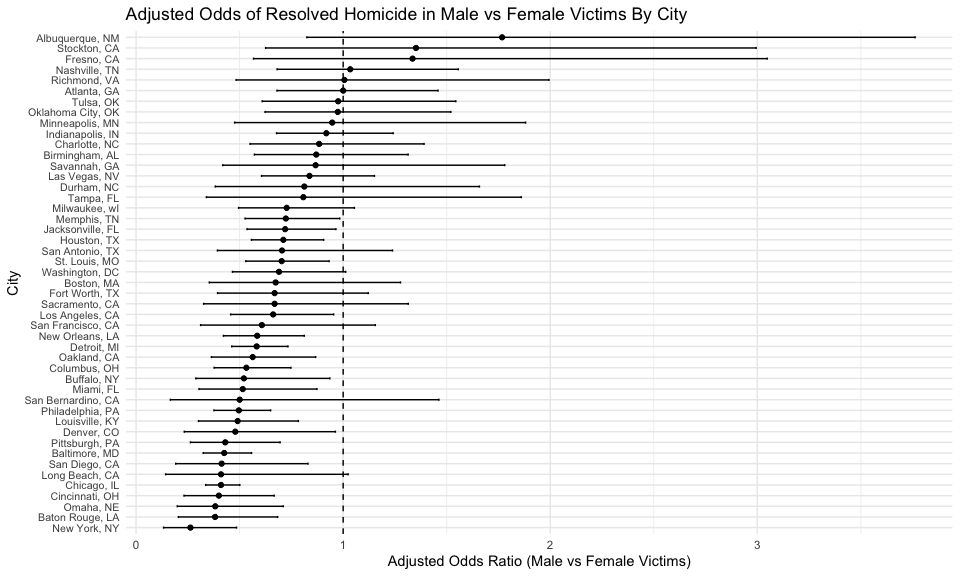
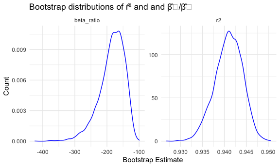
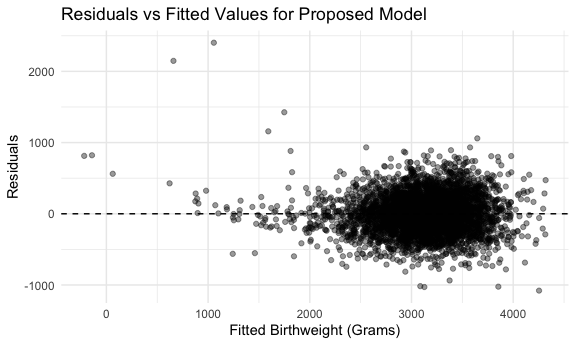

P8105 Homework 6
================
Maria Serafini

## Problem 1

The code below imports the `homicide-data` dataset from the Washington
Post. This dataset consists of individual homicide records collected
from 50 large U.S. cities. Each row represents a single homicide case,
and the variables provide information about the victim, the
circumstances of the homicide, and the status of the investigation. Key
variables include the `city` and `state` in which the homicide occurred,
the `reported_date` of the homicide, the approximate geographic location
of the homicide given by `longitude` and `latitude`, and `disposition`
which represents the investigative status of the case.

``` r
homicide_df <- read_csv("data/homicide-data.csv")
```

The code below creates a `clean_homicide_df` dataset, which includes a
city-level summary of the homicide data. The `city` and `state`
variables are combined into a single`city_state` variable. A binary
`solved` variable is created to indicate whether the homeicide was
resolved by arrest. Cities that do not report the race of the homicide
victim are omitted. A misclassified city “Tulsa, AL” is removed.Victim
race is limited to “White” or “Black” for analysis purposes.

``` r
clean_homicide_df <- 
  homicide_df |> 
  unite(city_state, city, state, sep = ", ") |> 
  mutate(
    solved = as.numeric(disposition == "Closed by arrest"), 
    victim_age = as.numeric(victim_age)
  ) |> 
  filter(!city_state %in% c("Dallas, TX", "Phoenix, AZ", "Kansas City, MO", 
                         "Tulsa, AL")) |> 
  filter(
    victim_race %in% c("White", "Black")
  ) 
```

The code below fits a logistic regression to the Baltimore, MD data with
solved vs unsolved as the outcome and victim age, sex and race as
predictors.

``` r
baltimore_df <- 
  clean_homicide_df |> 
  filter(
    city_state == "Baltimore, MD"
  ) |> 
  select(solved, victim_age, victim_sex, victim_race)

baltimore_logfit = 
  baltimore_df |> 
  glm(solved ~ victim_age + victim_race + victim_sex, data = _, family = binomial()) 

baltimore_results <- 
  baltimore_logfit |> 
  broom::tidy(conf.int = TRUE, exponentiate = TRUE) |> 
  filter(term == "victim_sexMale") |> 
  select(term, 
         OR = estimate,
         CI_lower = conf.low,
         CI_upper = conf.high, 
         p.value)

baltimore_results |> 
  knitr::kable(digits = 3)
```

| term           |    OR | CI_lower | CI_upper | p.value |
|:---------------|------:|---------:|---------:|--------:|
| victim_sexMale | 0.426 |    0.324 |    0.558 |       0 |

In Baltimore, MD, the adjusted odds ratio for solving homicides
comparing male to female victims is approximately 0.43 (95% CI: 0.32,
0.56), indicating that homicides with male victims have substantially
lower odds of being solved than those with female victims, after
adjusting for age and race.

``` r
city_glm_results <- 
  clean_homicide_df |> 
  nest(data = -city_state) |> 
  mutate(
    fits = map(data, \(df) glm(solved ~ victim_age + victim_race + victim_sex, data = df, 
                               family = binomial())), 
    results = map(fits, broom::tidy, conf.int = TRUE, exponentiate = TRUE)
  ) |> 
  unnest(results) |> 
  filter(term == "victim_sexMale") |> 
  select(
    city_state, 
    OR = estimate,
    CI_lower = conf.low,
    CI_upper = conf.high,
    p.value
  )

city_glm_results |> 
  knitr::kable(digits = 3)
```

| city_state         |    OR | CI_lower | CI_upper | p.value |
|:-------------------|------:|---------:|---------:|--------:|
| Albuquerque, NM    | 1.767 |    0.825 |    3.762 |   0.139 |
| Atlanta, GA        | 1.000 |    0.680 |    1.458 |   1.000 |
| Baltimore, MD      | 0.426 |    0.324 |    0.558 |   0.000 |
| Baton Rouge, LA    | 0.381 |    0.204 |    0.684 |   0.002 |
| Birmingham, AL     | 0.870 |    0.571 |    1.314 |   0.511 |
| Boston, MA         | 0.674 |    0.353 |    1.277 |   0.226 |
| Buffalo, NY        | 0.521 |    0.288 |    0.936 |   0.029 |
| Charlotte, NC      | 0.884 |    0.551 |    1.391 |   0.600 |
| Chicago, IL        | 0.410 |    0.336 |    0.501 |   0.000 |
| Cincinnati, OH     | 0.400 |    0.231 |    0.667 |   0.001 |
| Columbus, OH       | 0.532 |    0.377 |    0.748 |   0.000 |
| Denver, CO         | 0.479 |    0.233 |    0.962 |   0.041 |
| Detroit, MI        | 0.582 |    0.462 |    0.734 |   0.000 |
| Durham, NC         | 0.812 |    0.382 |    1.658 |   0.576 |
| Fort Worth, TX     | 0.669 |    0.394 |    1.121 |   0.131 |
| Fresno, CA         | 1.335 |    0.567 |    3.048 |   0.496 |
| Houston, TX        | 0.711 |    0.557 |    0.906 |   0.006 |
| Indianapolis, IN   | 0.919 |    0.678 |    1.241 |   0.582 |
| Jacksonville, FL   | 0.720 |    0.536 |    0.965 |   0.028 |
| Las Vegas, NV      | 0.837 |    0.606 |    1.151 |   0.278 |
| Long Beach, CA     | 0.410 |    0.143 |    1.024 |   0.072 |
| Los Angeles, CA    | 0.662 |    0.457 |    0.954 |   0.028 |
| Louisville, KY     | 0.491 |    0.301 |    0.784 |   0.003 |
| Memphis, TN        | 0.723 |    0.526 |    0.984 |   0.042 |
| Miami, FL          | 0.515 |    0.304 |    0.873 |   0.013 |
| Milwaukee, wI      | 0.727 |    0.495 |    1.054 |   0.098 |
| Minneapolis, MN    | 0.947 |    0.476 |    1.881 |   0.876 |
| Nashville, TN      | 1.034 |    0.681 |    1.556 |   0.873 |
| New Orleans, LA    | 0.585 |    0.422 |    0.812 |   0.001 |
| New York, NY       | 0.262 |    0.133 |    0.485 |   0.000 |
| Oakland, CA        | 0.563 |    0.364 |    0.867 |   0.009 |
| Oklahoma City, OK  | 0.974 |    0.623 |    1.520 |   0.908 |
| Omaha, NE          | 0.382 |    0.199 |    0.711 |   0.003 |
| Philadelphia, PA   | 0.496 |    0.376 |    0.650 |   0.000 |
| Pittsburgh, PA     | 0.431 |    0.263 |    0.696 |   0.001 |
| Richmond, VA       | 1.006 |    0.483 |    1.994 |   0.987 |
| San Antonio, TX    | 0.705 |    0.393 |    1.238 |   0.230 |
| Sacramento, CA     | 0.669 |    0.326 |    1.314 |   0.255 |
| Savannah, GA       | 0.867 |    0.419 |    1.780 |   0.697 |
| San Bernardino, CA | 0.500 |    0.166 |    1.462 |   0.206 |
| San Diego, CA      | 0.413 |    0.191 |    0.830 |   0.017 |
| San Francisco, CA  | 0.608 |    0.312 |    1.155 |   0.134 |
| St. Louis, MO      | 0.703 |    0.530 |    0.932 |   0.014 |
| Stockton, CA       | 1.352 |    0.626 |    2.994 |   0.447 |
| Tampa, FL          | 0.808 |    0.340 |    1.860 |   0.619 |
| Tulsa, OK          | 0.976 |    0.609 |    1.544 |   0.917 |
| Washington, DC     | 0.690 |    0.465 |    1.012 |   0.061 |

Overall, the plot below shows that in most cities, homicides involving
male victims have lower adjusted odds of being solved than those
involving female victims, and in roughly half of the cities this
difference is statistically significant. A small number of cities have
odds ratios above 1, but wide confidence intervals that include 1,
indicating substantial uncertainty rather than strong evidence of a
reversal of this pattern.

``` r
city_glm_results |> 
  mutate(city_state = fct_reorder(city_state, OR)) |> 
  ggplot(aes(x = OR, y = city_state)) + 
  geom_vline(xintercept = 1, linetype = "dashed") +
  geom_errorbarh(aes(xmin = CI_lower, xmax = CI_upper), height = 0.2) +
  geom_point() + 
  labs(
    title = "Adjusted Odds of Resolved Homicide in Male vs Female Victims By City",
    x = "Adjusted Odds Ratio (Male vs Female Victims)",
    y = "City"
  ) +
  theme(axis.text.y = element_text(size = 8)) 
```



## Problem 2

The code below imports the Central Park weather data from
p8105.datasets. This dataset contains daily meteorological observations
recorded in New York City, including minimum and maximum temperature
(`tmin`, `tmax`) and total daily precipitation (`prcp`).

``` r
data("weather_df")
```

The code below generates 5000 bootstrap samples from the original
dataset and fits the linear regression model
$tmax = \beta_0 + \beta_1\, tmin + \beta_2\, prcp + \varepsilon$ to
extract the estimated quantities $\widehat{r}^2$ and
$\widehat{\beta}_1 / \widehat{\beta}_2$. For each bootstrap sample, the
model is re-fit, and the two quantities of interest are extracted using
`broom::glance()` for $\widehat{r}^2$ and `broom::tidy()` for
$\widehat{\beta}_1 / \widehat{\beta}_2$.

``` r
set.seed(1)

boot_weather <- 
  weather_df |> 
  modelr::bootstrap(n = 5000) |> 
  mutate(
    models = map(strap, \(df) lm(tmax ~ tmin + prcp, data = df)), 
    results = map(models, broom::tidy), 
    glance = map(models, broom::glance)
  ) 


boot_rsquared <- 
  boot_weather |> 
  select(.id, glance) |> 
  unnest(glance) |> 
  transmute(.id, r2 = r.squared)

boot_ratio <- 
  boot_weather |> 
  select(.id, results) |> 
  unnest(results) |> 
  select(.id, term, estimate) |> 
  filter(term %in% c("tmin", "prcp")) |> 
  pivot_wider(
    names_from = term,
    values_from = estimate
  ) |> 
  mutate(
    beta_ratio = tmin / prcp) |> 
  select(.id, beta_ratio)
```

The plots below show the bootstrap sampling distributions for both
estimated quantities. The distribution of $\widehat{r}^2$ is tightly
concentrated, reflecting the strong linear relationship between minimum
and maximum temperature. In contrast, the bootstrap distribution of the
coefficient ratio $\widehat{\beta}_1 / \widehat{\beta}_2$ is much more
variable and noticeably left-skewed. This increased variability and
skewness are consistent with the relatively small and unstable estimated
effect of precipitation in the regression model.

``` r
boot_summary <- 
  boot_rsquared |> 
  inner_join(boot_ratio, by = ".id")

boot_summary |> 
  pivot_longer(
    cols = c(r2, beta_ratio),
    names_to = "quantity", 
    values_to = "value", 
  ) |> 
  mutate(
    quantity = recode(
      quantity, 
      "r2" = "hat(r)^2",
      "beta_ratio" = "hat(beta)[1] / hat(beta)[2]")
  ) |> 
  ggplot(aes(x = value)) +
  geom_density(color = "blue") + facet_wrap(~ quantity, scales = "free", labeller = label_parsed) +
  labs(
    title = expression(
      "Bootstrap distributions of " * hat(r)^2 * " and " * hat(beta)[1] / hat(beta)[2]
    ),
    x = "Bootstrap Estimate", 
    y = "Density"
  )
```



The code below identifies the 2.5% and 97.5% quantiles of each bootstrap
distribution to construct 95% confidence intervals for the estimated
quantities.

``` r
boot_summary |> 
  summarize(
    r2_lower = quantile(r2, 0.025), 
    r2_upper = quantile(r2, 0.975), 
    ratio_lower = quantile(beta_ratio, 0.025), 
    ratio_upper = quantile(beta_ratio, 0.975)
  )
```

    ## # A tibble: 1 × 4
    ##   r2_lower r2_upper ratio_lower ratio_upper
    ##      <dbl>    <dbl>       <dbl>       <dbl>
    ## 1    0.934    0.947       -280.       -126.

## Problem 3

The code below imports the birthweight dataset, which contains detailed
information on approximately 4,000 infants and their mothers. Each row
represents a single birth, and the dataset includes variables describing
infant characteristics (e.g., sex, birthweight, head circumference, and
length), maternal and paternal demographic factors, maternal health
indicators, and pregnancy-related behaviors. Key variables include `bwt`
(birthweight in grams), `blength` and `bhead` (infant length and head
circumference at birth), `gaweeks` (gestational age in weeks), and
several maternal characteristics such as pre-pregnancy BMI, weight gain
during pregnancy, smoking, and age at delivery.

``` r
birthweight_df <- read_csv("data/birthweight.csv")
```

To prepare the dataset for regression analysis, descriptive variable
names were applied and several numeric variables were converted to
factors to better reflect their categorical structure. The dataset was
then assessed for completeness by computing the number of missing values
in each variable. As shown below, all variables contain zero missing
values so no additional filtering is required.

``` r
birthweight_df <-
  birthweight_df |> 
  rename(
    sex = babysex, 
    head_circumference = bhead, 
    birth_length = blength,
    birth_wt = bwt, 
    mom_wt_delivery = delwt, 
    monthly_income = fincome, 
    dad_race = frace, 
    mom_race = mrace, 
    gestational_age = gaweeks, 
    malformations = malform,
    mom_age_menarche = menarche, 
    mom_height = mheight, 
    mom_age_delivery = momage, 
    count_past_lbwt = pnumlbw,
    count_past_small_ga = pnumsga, 
    mom_pre_bmi = ppbmi, 
    mom_pre_wt = ppwt, 
    count_smoke = smoken, 
    mom_wt_gain = wtgain
  ) |> 
  mutate(
    sex = factor(sex, levels = c(1,2), labels = c("Male", "Female")), 
    dad_race = factor(
      dad_race,
      levels = c(1,2,3,4,8,9),
      labels = c("White", "Black", "Asian", "Puerto Rican", "Other", "Unknown")), 
    mom_race = factor(
      mom_race, 
      levels = c(1,2,3,4,8),
      labels = c("White", "Black", "Asian", "Puerto Rican", "Other")), 
    malformations = factor(
      malformations, 
      levels = c(0, 1),
      labels = c("absent", "present"))
    ) 


birthweight_df |> 
  summarise(across(everything(), ~ sum(is.na(.))))
```

    ## # A tibble: 1 × 20
    ##     sex head_circumference birth_length birth_wt mom_wt_delivery monthly_income
    ##   <int>              <int>        <int>    <int>           <int>          <int>
    ## 1     0                  0            0        0               0              0
    ## # ℹ 14 more variables: dad_race <int>, gestational_age <int>,
    ## #   malformations <int>, mom_age_menarche <int>, mom_height <int>,
    ## #   mom_age_delivery <int>, mom_race <int>, parity <int>,
    ## #   count_past_lbwt <int>, count_past_small_ga <int>, mom_pre_bmi <int>,
    ## #   mom_pre_wt <int>, count_smoke <int>, mom_wt_gain <int>

The code below fits a proposed linear regression model for birthweight
that incorporates a set of biologically and clinically relevant
predictors. This model includes infant head circumference, birth length,
gestational age, maternal pre-pregnancy BMI, maternal weight gain during
pregnancy, number of cigarettes smoked per day, infant sex, paternal
race, and parity. These variables were selected to capture fetal size at
birth, duration of gestation, maternal health and pregnancy-related
behaviors, and demographic factors that may influence birth outcomes.

``` r
birth_wt_model <- 
  lm(birth_wt ~ head_circumference + birth_length + gestational_age + mom_pre_bmi +
                         mom_wt_gain + count_smoke + sex + dad_race + parity, data = birthweight_df)

birth_wt_model |> 
  broom::tidy()
```

    ## # A tibble: 13 × 5
    ##    term                 estimate std.error statistic   p.value
    ##    <chr>                   <dbl>     <dbl>     <dbl>     <dbl>
    ##  1 (Intercept)          -5767.     101.      -56.9   0        
    ##  2 head_circumference     132.       3.47     38.0   2.97e-273
    ##  3 birth_length            76.7      2.02     37.9   5.79e-272
    ##  4 gestational_age         11.5      1.47      7.82  6.34e- 15
    ##  5 mom_pre_bmi              7.33     1.34      5.48  4.55e-  8
    ##  6 mom_wt_gain              4.10     0.395    10.4   5.95e- 25
    ##  7 count_smoke             -4.55     0.589    -7.71  1.53e- 14
    ##  8 sexFemale               30.9      8.52      3.63  2.85e-  4
    ##  9 dad_raceBlack         -144.       9.32    -15.5   1.22e- 52
    ## 10 dad_raceAsian          -70.7     41.1      -1.72  8.56e-  2
    ## 11 dad_racePuerto Rican  -138.      18.6      -7.40  1.61e- 13
    ## 12 dad_raceOther          -55.8     73.7      -0.758 4.49e-  1
    ## 13 parity                  91.5     40.7       2.25  2.46e-  2

``` r
birth_wt_model |> 
  broom::glance()
```

    ## # A tibble: 1 × 12
    ##   r.squared adj.r.squared sigma statistic p.value    df  logLik    AIC    BIC
    ##       <dbl>         <dbl> <dbl>     <dbl>   <dbl> <dbl>   <dbl>  <dbl>  <dbl>
    ## 1     0.713         0.712  275.      897.       0    12 -30537. 61102. 61191.
    ## # ℹ 3 more variables: deviance <dbl>, df.residual <int>, nobs <int>

The code below creates a residuals-versus-fitted plot using
`add_predictions()` and `add_residuals()` to evaluate model assumptions.
The plot shows residuals centered around zero with no strong evidence of
curvature or heteroskedasticity, suggesting that the linear model form
is broadly appropriate for these predictors.

``` r
birthweight_df |> 
  add_predictions(birth_wt_model) |> 
  add_residuals(birth_wt_model) |> 
  ggplot(aes(x = pred, y = resid)) +
  geom_point(alpha = 0.4) +
  geom_hline(yintercept = 0, linetype = "dashed") +
  labs(
    x = "Fitted Birthweight (Grams)",
    y = "Residuals",
    title = "Residuals vs Fitted Values for Proposed Model"
  )
```


